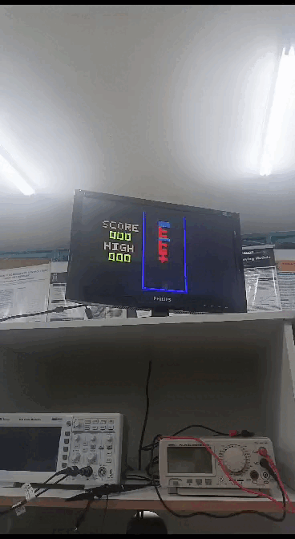

<h3 align="justify">Jogo inspirado no clássico Tetris, desenvolvido para o kit de desenvolvimento DE1-SoC utilizando linguagem C e Assembly </h3>

 
<h2> Sobre o Projeto</h2>

Este projeto se concentra no gerenciamento de uma Unidade de Processamento Gráfico (GPU) especializada, desenvolvida para manipulação de saídas gráficas em sistemas computacionais. Também conhecida como placa de vídeo, a GPU é responsável por aliviar a CPU de tarefas intensas relacionadas à renderização de gráficos, que demanda cálculos complexos e frequentes.

Diferente de outros componentes de hardware, uma GPU possui uma estrutura relativamente sofisticada, composta por unidades de lógica aritmética, registradores, e até memória dedicada, além de, em alguns casos, uma ISA própria para executar operações gráficas específicas. A interação com a GPU requer um software especializado que realize o gerenciamento adequado do dispositivo e estabeleça uma comunicação eficiente com o sistema, garantindo que os sinais digitais corretos sejam gerados para cada operação.

Nesse contexto, o problema 2 do módulo integrador TEC499 - SISTEMAS DIGITAIS do curso de Engenharia de Computação da UEFS propõe a criação de uma biblioteca em linguagem assembly para ARMv7, focada no gerenciamento da GPU. A GPU utilizada neste projeto foi projetada por Gabriel Sá Barreto Alves como parte de sua iniciação científica e trabalho de conclusão de curso, implementada em uma FPGA no kit DE1-SoC.

Este relatório aborda a construção desse sistema de gerenciamento para a GPU, explicando o desenvolvimento da biblioteca em assembly, a lógica de controle da GPU e a comunicação com o dispositivo, tudo integrado ao ambiente de desenvolvimento DE1-SoC para execução.

Os requisitos para elaboração do sistema são apresentados a seguir:

* O código da biblioteca deve ser escrito em linguagem aseembly; 
* A biblioteca deve conter as funções essenciais para que seja possível implementar a parte gráfica do jogo usando o Processador Gráfico;

<h2>  Equipe:  </h2>
<uL> 
  <li><a href="https://github.com/Oguelo">Alex da Fonseca Dantas Junior</a></li>
  <li><a href="https://github.com/BRCZ1N">Bruno Campos de Oliveira Rocha</a></li>
  <li><a href="https://github.com/duasck">Luis Eduardo Leite Azevedo</a></li>
</ul>

<h1 align="center"> Sumário </h1>

    <ul>
       <li><a href="#Introdução">Introdução</a></li>
        <li><a href="#Metodologia">Metodologia</a></li>
        <li><a href="#Resultados">Resultados</a></li>
        <li><a href="#makefile">Makefile</a></li>  
        <li><a href="#conclusao">Conclusão</a></li>
        <li><a href="#referencia">Referências</a></li>
  </ul>

 
<h2> Descrição dos Equipamentos e Software Utilizados</h2>

Nesta seção, são apresentados os equipamentos e software utilizados durante o desenvolvimento do projeto.

<h3>Kit de desenvolvimento DE1-SoC</h3>

A placa DE1-SoC é um kit de desenvolvimento que integra um processador ARM Cortex-A9 dual-core com um FPGA Cyclone V da Intel, proporcionando uma poderosa plataforma para projetos que combinam software e hardware. Com uma ampla variedade de periféricos, como portas VGA, Ethernet, USB, e áudio, a DE1-SoC é ideal para aplicações em sistemas embarcados e FPGA. Devido à sua versatilidade, essa placa é amplamente utilizada em ambientes educacionais e de pesquisa, facilitando o aprendizado e o desenvolvimento de projetos em ambas as áreas.
Abaixo estão os elementos utilizados na construção desse projeto:

<h3> Linguagem C</h3>
A linguagem C foi escolhida por sua eficiência, portabilidade e ampla aplicação em sistemas embarcados. Com uma sintaxe simples, ela oferece controle preciso sobre o hardware, além de contar com bibliotecas padrão e ferramentas que facilitam o desenvolvimento de código compacto e otimizado, ideal para dispositivos com recursos limitados.

<h3> Linguagem Assembly</h3>
A linguagem assembly foi escolhida por sua capacidade de oferecer controle direto sobre o hardware, permitindo o máximo de otimização e eficiência em sistemas embarcados. Com uma sintaxe próxima ao código de máquina, o assembly possibilita o uso específico de registradores e instruções, aproveitando ao máximo os recursos da arquitetura ARMv7. Essa escolha é ideal para aplicações em que desempenho e controle absoluto sobre o processamento são essenciais, especialmente em dispositivos com recursos limitados, onde o gerenciamento preciso do hardware é fundamental.

<h3> Compilador GNU</h3>

O GCC, abreviação de "GNU Compiler Collection" (Coleção de Compiladores GNU), é uma popular distribuição de compiladores que oferece suporte a diversas linguagens de programação, como C, C++, Objective-C, Fortran e Ada. Quando executado, o GCC realiza várias etapas, incluindo pré-processamento, compilação, montagem e vinculação. Ele também disponibiliza uma ampla variedade de opções de linha de comando, permitindo que o desenvolvedor personalize o processo de compilação conforme suas necessidades específicas

<h3>Vistual Studio Code</h3>

O Visual Studio Code, conhecido como VSCode, é um ambiente de desenvolvimento amplamente usado. Desenvolvido pela Microsoft, é um editor de código gratuito e de código aberto com recursos como realce de sintaxe, conclusão de código e depuração integrada. Suporta várias linguagens e possui extensões para personalização. No projeto ele foi utilizado para desenvolver o código fonte do jogo.

<h3> Monitor CRT</h3>

O monitor utilizado no projeto foi o DELL M782p, um modelo de CRT que utiliza tubo de raios catódicos para exibição de imagens. Com uma tela de 17 polegadas e resolução máxima de 1280x1024 pixels, ele oferece uma interface VGA para conexão com computadores ou placas de desenvolvimento. Os monitores CRT, como o DELL M782p, são conhecidos por sua reprodução de cores vibrantes e tempos de resposta rápidos, tornando-os ideais para projetos que exigem interação em tempo real, como jogos e simulações.

Abaixo estão dados detalhados sobre o monitor usado:

|            Características            |      Detalhes      |
| :------------------------------------: | :----------------: |
|       **Tipo de Display**       |      Vertical      |
| **Tamanho da Tela (Horizontal)** |      32,4 cm      |
|  **Tamanho da Tela (Vertical)**  |      24,6 cm      |
|  **Tamanho da Tela (Diagonal)**  |      40,6 cm      |
|      **Varredura Vertical**      |    50 - 160 Hz    |
|     **Varredura Horizontal**     |    30 - 70 kHz    |
|  **Tamanho da Tela (Diagonal)**  |   43,2 cm (17")   |
|          **Dot Pitch**          |  0,270 x 0,270 mm  |
|     **Resolução Máxima**     | 1280 x 1024 pixels |
|    **Resolução do Display**    | 1024 x 768 pixels |

<h2> Estrutura da Placa DE1-SoC </h2>

Nesta parte, será detalhada a arquitetura da placa DE1-SoC, incluindo o processador ARM Cortex-A9, a organização dos registradores, o mapeamento dos dispositivos de entrada/saída na memória, o uso da memória, a comunicação entre o processador e o FPGA, além do processo de compilação nativa diretamente na placa.

<h3>Resumo dos Recursos do Processador ARM Cortex-A9 </h3>

O ARM Cortex-A9 é baseado em uma arquitetura RISC (Reduced Instruction Set Computing), onde operações aritméticas e lógicas são realizadas nos registradores de propósito geral. A movimentação de dados entre memória e registradores é feita através de instruções Load e Store, com comprimento de palavra de 32 bits e endereçamento em estilo little-endian.

<h3>Organização dos Registradores</h3>

O processador ARM Cortex-A9 contém 15 registradores de propósito geral (R0 a R14), um contador de programa (R15) e um registrador de status do programa atual (CPSR), todos com 32 bits. Dois registradores têm tratamento especial: R13 é o Stack Pointer, enquanto R14 atua como registrador de link em chamadas de sub-rotina.

<h3>Instruções e Modo Thumb</h3>

As instruções têm 32 bits e são armazenadas na memória com alinhamento de palavras. O conjunto de instruções Thumb oferece uma versão reduzida com instruções de 16 bits, o que diminui os requisitos de memória, algo útil em sistemas embarcados.

<h3>Memória Utilizada</h3>

O HPS (Hard Processor System) conta com uma interface de memória que conecta o ARM MPCORE a uma memória DDR3 de 1 GB. Esta memória serve como armazenamento de dados e programas para os processadores ARM. Organizada como 256M x 32 bits, ela pode ser acessada por palavras de 32 bits, meias palavras e bytes.

<h3>Mapeamento de Dispositivos de Entrada/Saída</h3>

Os dispositivos de E/S disponíveis ao processador ARM são mapeados diretamente na memória e acessados como se fossem endereços de memória, utilizando as instruções Load e Store.

<h3>Interrupções de Hardware</h3>

Dispositivos de E/S podem gerar interrupções de hardware, ativando as linhas de solicitação de interrupção (IRQ ou FIQ) do processador. Quando ocorre uma interrupção, o processador entra no modo de exceção correspondente e salva o estado atual do programa. Antes de retornar à execução, o endereço salvo no registrador de link deve ser decrementado em 4.

<h3>Diagrama de Blocos da Placa DE1-SoC</h3>

O sistema DE1-SoC é composto pelo HPS e pelo FPGA, ambos integrados no chip Cyclone V SoC. O HPS inclui um processador ARM Cortex-A9 dual-core, uma interface de memória DDR3 e periféricos. O FPGA implementa dois processadores Intel Nios II e vários periféricos conectados.

<h3>Compilação Nativa na DE1-SoC</h3>

A compilação nativa ocorre quando o código é compilado no mesmo sistema em que será executado. Aqui, a compilação será realizada diretamente na placa, utilizando a linha de comando do Linux e as ferramentas de compilação integradas. O comando `gcc` invoca o GNU C Compiler, um compilador de código aberto muito usado para gerar executáveis no Linux.

## Metodologia

### Funcionamento da GPU

Para controlar a GPU, foi necessário entender a arquitetura e os modos de comunicação desta unidade gráfica. A GPU utiliza instruções de 64 bits e se comunica através dos barramentos de dados `DATA A` e `DATA B`. Abaixo, é detalhado o funcionamento da GPU:

- **Instruções de 64 Bits**: A GPU opera com instruções de 64 bits, onde o campo `opcode` (4 bits) no início da palavra identifica o tipo de operação. Dependendo da instrução, a palavra é dividida entre `DATA A` e `DATA B`. Quando o sinal `START` recebe um nível lógico alto, os valores de `DATA A` e `DATA B` são inseridos nas filas FIFO de instrução, e a GPU processa os dados conforme a operação indicada.

- **Controle de FIFO**: Um barramento de saída indica o estado das filas FIFO (se estão cheias), permitindo evitar a perda de instruções por excesso de inserção.

- **Memórias de Sprites e Background**: 
  - **Memória de Sprites**: Capaz de armazenar até 31 sprites simultâneas, cada sprite possui dados de cada pixel individualmente.
  - **Memória de Background**: Armazena 4800 blocos de 8x8 pixels, formando uma grade de 80x60 que compõe o fundo da tela.
  - **Registradores**: A GPU possui 32 registradores que guardam o endereço de cada sprite ativa. O registrador 1 é reservado para a cor de background.

- **Saída em VGA**: A GPU gera uma saída no formato VGA (640x480 pixels), que é enviada diretamente à porta VGA da placa, sem necessidade de tratamento adicional.

- **Gerenciamento de Polígonos**: A GPU é capaz de desenhar polígonos como quadrados ou triângulos de tamanhos predefinidos, selecionados via instrução.

### Instruções da GPU

A GPU utiliza quatro instruções principais, conforme descrito abaixo:

1. **WBR (0000 - Escrita no Banco de Registradores)**: Modifica o endereço de memória referenciado pelo registrador alvo, associando-o a uma sprite específica.

2. **WSM (0001 - Escrita na Memória de Sprites)**: Altera o valor de um endereço na memória de sprites, modificando o valor de um pixel da sprite.

3. **WBM (0010 - Escrita na Memória de Background)**: Modifica a cor de um bloco específico no background.

4. **DP  (0011 - Definição de Polígono)**: Define um polígono com tamanho, cor e posição específicas, associando-o a um registrador selecionado.

| Instrução                               | Parâmetros                             |
|-----------------------------------------|:--------------------------------------:|
| WBR_GB                        | R, G, B                                          |
| WBR_S                         | reg, offset, R, G, B                             |
| WSM                           | reg, pixel, R, G, B                              |
| WBM                           | mem_address, R, G, B                             |
| DP                      | address, ref_point_x, ref_point_y, size, R, G, B, shape|

|            Variável            |      Significado      | Intervalo |
| :------------------------------------: | :----------------: |:----------------: |
| R | Intensidade do vermelho | 0 - 7 |
| G | Intensidade do verde | 0 - 7 |
| B | Intensidade do azul | 0 - 7 |
| X | Coordenada em relação ao eixo X | 0 - 640 |
| Y | Coordenada em relação ao eixo Y | 0 - 480 |
| reg | Registrador onde os parâmetros serão armazenados | -- |
| offset | Localização do sprite na memoria | -- |
| onScreen | Indicação para mostrar a informação na tela ou não | 0 - 1 |
| pixel | Endereço de um pixel na memoria de sprites | -- |
| ref_point_x | Coordenada do ponto de referência em relação a X | -- |
| ref_point_y | Coordenada do ponto de referência em relação a Y | -- |
| size | Dimensão do polígono | 1 - 12 |
| shape | Formado do polígono, podendo ser quadrado ou triangulo | 0 - 1 |

### Biblioteca

A biblioteca foi criada com o propósito de possibilitar a interação do usuário com a GPU, facilitando o envio de instruções e dados. Ela abstrai a complexidade do acesso direto aos 
registradores e buffers FIFO da GPU.

As principais funções da biblioteca estão localizadas no arquivo `GpuLib.asm` e incluem:

#### Função de Mapeamento de Memória (`gpuMapping`)

Responsável por abrir o dispositivo de memória e mapear o endereço base de controle da GPU. A função utiliza chamadas de sistema para abrir e mapear a memória, permitindo o acesso direto aos registradores da GPU.

#### Função de Fechamento de Mapeamento (`closeGpuMapping`)

Finaliza o mapeamento de memória, liberando os recursos e fechando o descritor de arquivo do dispositivo. Garante que a memória mapeada seja liberada corretamente, evitando erros em caso de múltiplas chamadas.

#### Função de Verificação de FIFO Cheia (`isFull`)

Verifica se o FIFO da GPU está cheio antes de enviar uma nova instrução. A função checa o estado do FIFO e retorna um valor indicando se ele está ocupado.

#### Função de Envio de Instruções (`sendInstruction`)

Envia uma instrução para a GPU. Antes de enviar, a função verifica o status do FIFO, e, se disponível, envia as instruções apropriadas nos barramentos correspondentes(DATA_A e DATA_B) para o dispositivo.

#### Funções de Configuração de Gráficos

Funções para configurar diversos aspectos gráficos da tela, incluindo:

- **Cor de Fundo (`setBackgroundColor`)**: Define a cor de fundo da tela utilizando valores RGB, utilizando a instrução **WBR** para escrever a cor no registrador no banco de registradores.

- **Blocos de Fundo (`setBackgroundBlock`)**: Permite configurar a cor de blocos específicos no plano de fundo da tela. Utiliza a instrução **WBM** para escrever diretamente na memória de background, alterando as cores dos blocos de 8x8 pixels.

- **Sprites (`setSprite`)**: Define a posição, offset e visibilidade das sprites na tela. Usa a instrução **WBR** para configurar o registrador do sprite, ajustando sua posição, offset e o bit de ativação que controla a exibição do sprite.

- **Polígono (`setPolygon`)**: Define polígonos com propriedades específicas, como posição e tamanho, para exibição na tela. Utiliza a instrução **DP** para desenhar o polígono na tela, configurando sua forma (quadrado ou triângulo), tamanho e coordenadas.

Essas funções no arquivo `GpuLib.asm` oferecem uma interface simplificada para manipulação da GPU, possibilitando o envio de comandos específicos sem a necessidade de acesso direto aos registradores e buffers FIFO.

#### Adaptação de funções do jogo anterior

Usando essas funções das bibliotecas desenvolvemos novas funções para o jogo são elas: 

- `drawBoard`: Esta função é responsável por desenhar o estado atual do tabuleiro do jogo. 
- `videoBox`: Esta função existia na primeira versão do game, onde, ao receber coordenadas iniciais e finais (x, y) e uma cor RGB, criava blocos gráficos na tela. Para manter a compatibilidade com a estrutura original do jogo, recriamos essa função na nova versão.
- `convertHexToRgb`: A função `convertHexToRgb` é necessária porque o `videoBox` recebe uma cor em formato hexadecimal RGB, enquanto nossa GPU exige um valor de 8 bits para cada componente de cor (`R`, `G` e `B`), com intensidade variando de 0 a 7. Assim, criamos essa função para converter as cores para o formato compatível com a GPU.
- `generateBox`: Esta função gera um bloco colorido no fundo, posicionando-o em uma localização específica baseada em coordenadas de coluna e linha (column e line). Recebe os valores de cor em componentes RGB (`R`, `G`, `B`) e o comprimento do bloco (length).
- `videoClear`: Limpa a tela.

## Resultados

Usando essas funções das bibliotecas desenvolvemos novas funções para o jogo são elas: 

- `drawBoard`: Esta função é responsável por desenhar o estado atual do tabuleiro do jogo. 
- `videoBox`: Esta função existia na primeira versão do game, onde, ao receber coordenadas iniciais e finais (x, y) e uma cor RGB, criava blocos gráficos na tela. Para manter a compatibilidade com a estrutura original do jogo, recriamos essa função na nova versão.
- `convertHexToRgb`: A função `convertHexToRgb` é necessária porque o `videoBox` recebe uma cor em formato hexadecimal RGB, enquanto nossa GPU exige um valor de 8 bits para cada componente de cor (`R`, `G` e `B`), com intensidade variando de 0 a 7. Assim, criamos essa função para converter as cores para o formato compatível com a GPU.
- `generateBox`: Esta função gera um bloco colorido no fundo, posicionando-o em uma localização específica baseada em coordenadas de coluna e linha (column e line). Recebe os valores de cor em componentes RGB (`R`, `G`, `B`) e o comprimento do bloco (length).
- `videoClear`: Limpa a tela.

### Funcionamento do jogo 

    
    
Demonstração da jogabilidade do jogo.

    
    
Demonstração da função de pause.

    
    
Demonstração da pontuação.

    
    
Demonstração do game over.

 
<h2>Makefile</h2>

Para atender aos requisitos e simplificar o processo de compilação e execução do projeto, foi gerado um `Makefile`. Este arquivo serve como uma ferramenta que automatiza a construção do projeto, facilitando o gerenciamento do processo de compilação. O `Makefile` executa as seguintes operações:

- **Compilação**: Compila os arquivos de código-fonte em arquivos objeto.
- **Linkagem**: Combina os arquivos objeto em um executável.
- **Limpeza**: Remove arquivos temporários e o executável gerado.
- **Execução**: Permite iniciar o programa compilado.

 
<h2>Guia de Instalação e Execução</h2>

Para iniciar o projeto, siga os passos abaixo para obter o código-fonte, compilar o código e executá-lo em um dispositivo FPGA DE1-SoC.

**Passo 1: Clonar o Repositório**

Abra o terminal e execute o seguinte comando para obter o código do repositório:

    git clone https://github.com/BRCZ1N/MI-SistemasDigitais-Problema-2.git

**Passo 2: Acessar o Diretório**

    cd MI-SistemasDigitais-Problema-2\Modules

**Passo 3: Compile e execute o código usando o comando:**

    make 

 
<h2> Conclusão</h2>

O desenvolvimento deste projeto de Tetris para a placa DE1-SoC, utilizando linguagem C, demonstrou a versatilidade e o poder de integração entre hardware e software oferecidos por essa plataforma. Ao implementar o jogo, foi possível explorar a interface gráfica transmitida via VGA, o controle responsivo utilizando um acelerômetro e botões, além da manipulação de memória e dispositivos de entrada/saída diretamente no hardware. Entretanto, não foi possível implementar recursos, tais como, rotação de tetrominos e aumento de nível com base na pontuação, esses recursos gerariam ainda mais diversidade e são possíveis de serem feitos com esse projeto base.
O projeto proporcionou uma oportunidade  de combinar conceitos de sistemas embarcados, como controle de periféricos, algoritmos de movimentação e colisão, e lógica de geração e remoção de peças, em uma aplicação prática e divertida. A utilização da DE1-SoC permitiu expandir o conhecimento sobre FPGAs, além de aprimorar as habilidades de programação em C para sistemas com recursos limitados.
<li><a href="#sumario">Voltar para o inicio</a></li>
 

 
<h2> Referências</h2>
<ul>
<li><a href="https://ftp.intel.com/Public/Pub/fpgaup/pub/Intel_Material/18.1/Computer_Systems/DE1-SoC/DE1-SoC_Computer_ARM.pdf">DE1-SoC Computer System with ARM* Cortex* A9 </a> - Acesso em 26 set. 2024. </li>
<li><a href="https://blogs.vmware.com/vsphere/2020/03/how-is-virtual-memory-translated-to-physical-memory.html"> NIELS HAGOORT. How is Virtual Memory Translated to Physical Memory? VMware vSphere Blog. </a> - Acesso em: 20 set. 2024.</li>
<li><a href="https://ftp.intel.com/Public/Pub/fpgaup/pub/Intel_Material/17.0/Tutorials/Linux_On_DE_Series_Boards.pdf" > Using Linux* on DE-series Boards </a> - Acesso em 24 set 2024.</li>
‌</ul>

